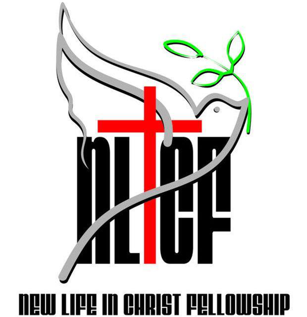

# NLCF-website-v1

1st production version of the New Life and Chirst Fellowship website. The website is made responsive by using
**Bourbon framework** grid system. **jQuery** and other third party libraries are used for animations and interactivity and 
**Gulp** Js for task runner. Git clone repo and run index.html to view and explore website.

***
